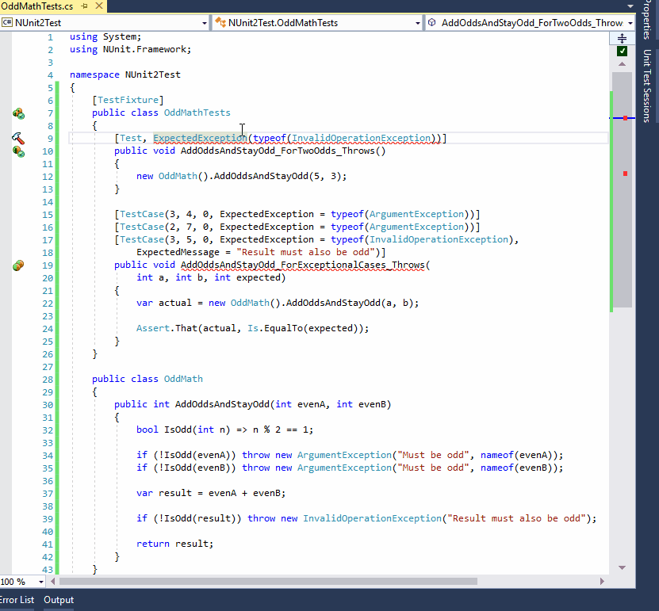

# Have a project grounded in NUnit v2 and want v3?

So you have your unit tests project founded on NUnit v2 realm. And you are considering the upgrade. And yes, your are right - this means three kind of changes you are going to deal with:

 1. **Straightforward ones** - easy to do with some regex replace.
 2. **Not so obvious ones** - you will need to take a careful look to make the code compile.
 3. **Really painful ones** - even if the code compiles, some unit tests result in red.

## Helping you with breaking changes

For vast majority of breaking changes introduced by v3 of the framework this utility reports warnings or errors, for some - equips you with code fixes. Here goes the example:

More on how to perform migration with the help of this utility can be found on [wiki](https://github.com/wachulski/nunit-migrator/wiki).

## Reference
See the following tables to see what is currently supported (based on https://github.com/nunit/docs/wiki/Breaking-Changes material).

##### Aid

 * :mag: - detecting breaking changes (Roslyn analyzer)
 * :bulb: - fixing breaking changes to v3 equivalent code (Roslyn code fix)

##### Development status

 * :white_check_mark: - released, the feature is there in place
 * :soon: - the feature is planned to be developed soon
 * :x: - there are no plans to develop the feature

###### Attributes

|            Name              |          Notes                                        | :mag: | :bulb: |
|------------------------------|-------------------------------------------------------|----------|------------|
| ExpectedExceptionAttribute   | No longer supported. Use `Assert.Throws` or `Assert.That`. | :white_check_mark: | :white_check_mark: |
| IgnoreAttribute              | The reason is now mandatory | :white_check_mark: | :white_check_mark: |
| RequiredAddinAttribute       | No longer supported. | :white_check_mark: | :x: |
| RequiresMTAAttribute         | Deprecated. Use `ApartmentAttribute`                    | :white_check_mark: | :white_check_mark: |
| RequiresSTAAttribute         | Deprecated. Use `ApartmentAttribute`                    | :white_check_mark: | :white_check_mark: |
| SuiteAttribute               | No longer supported. | :white_check_mark: | :x: |
| System.MTAThreadAttribute    | No longer treated as `RequiresMTAAttribute`             | :white_check_mark: | :white_check_mark: |
| System.STAThreadAttribute    | No longer treated as `RequiresSTAAttribute`             | :white_check_mark: | :white_check_mark: |
| TearDown and OneTimeTearDown | There is a change to the logic by which teardown methods are called. | :white_check_mark: | :x: |
| TestCaseAttribute            | Named parameter `Result=` is no longer supported. Use `ExpectedResult=`. Named parameter `Ignore=` now takes a string, giving the reason for ignoring the test.| :white_check_mark:  | :white_check_mark: |
| TestCaseSourceAttribute      | The attribute forms using a string argument to refer to the data source must now use only static fields, properties or methods. | :white_check_mark: | :white_check_mark: |
| TestFixtureAttribute         | Named parameter `Ignore=` now takes a string, giving the reason for ignoring the test. | :white_check_mark:  | :white_check_mark: |
| TestFixtureSetUpAttribute    | Deprecated. Use `OneTimeSetUpAttribute`.  | :white_check_mark: | :white_check_mark: |
| TestFixtureTearDownAttribute | Deprecated. Use `OneTimeTearDownAttribute`.  | :white_check_mark: | :white_check_mark: |
| ValueSourceAttribute         | The source name of the data source must now use only static fields, properties or  methods. | :white_check_mark: | :white_check_mark: |

###### Assertions and Constraints

|          Feature                 |          Notes                                        | :mag: | :bulb: |
|----------------------------------|-------------------------------------------------------|----------|------------|
| Assert.IsNullOrEmpty             | No longer supported. Use `Assert.That(..., Is.Null.Or.Empty)` | :white_check_mark: | :white_check_mark: |
| Assert.IsNotNullOrEmpty          | No longer supported. Use `Assert.That(..., Is.Not.Null.And.Not.Empty)` | :white_check_mark: | :white_check_mark: |
| Is.InstanceOfType                | No longer supported. Use `Is.InstanceOf`                    | :white_check_mark:  | :white_check_mark:  |
| Is.StringStarting                | Deprecated. Use `Does.StartWith` | :white_check_mark:  | :white_check_mark:  |
| Is.StringContaining              | Deprecated. Use `Does.Contain` | :white_check_mark:  | :white_check_mark:  |
| Is.StringEnding                  | Deprecated. Use `Does.EndWith` | :white_check_mark:  | :white_check_mark:  |
| Is.StringMatching                | Deprecated. Use `Does.Match` | :white_check_mark:  | :white_check_mark:  |
| NullOrEmptyStringConstraint      | No longer supported. See `Assert.IsNullOrEmpty` above   | :white_check_mark: | :x: |
| SubDirectoryContainsConstraint   | No longer supported. Various alternatives are available.    | :x: | :x: |
| Text.All                         | No longer supported. Use `Has.All` or `Is.All` | :white_check_mark:  | :white_check_mark:  |
| Text.Contains                    | No longer supported. Use `Does.Contain` or `Contains.Substring` | :white_check_mark:  | :white_check_mark:  |
| Text.DoesNotContain              | No longer supported. Use `Does.Not.Contain` | :white_check_mark:  | :white_check_mark:  |
| Text.StartsWith                  | No longer supported. Use `Does.StartWith` | :white_check_mark:  | :white_check_mark:  |
| Text.DoesNotStartWith            | No longer supported. Use `Does.Not.StartWith` | :white_check_mark:  | :white_check_mark:  |
| Text.EndsWith                    | No longer supported. Use `Does.EndWith` | :white_check_mark:  | :white_check_mark:  |
| Text.DoesNotEndWith              | No longer supported. Use `Does.Not.EndWith` | :white_check_mark:  | :white_check_mark:  |
| Text.Matches                     | No longer supported. Use `Does.Match` | :white_check_mark:  | :white_check_mark:  |
| Text.DoesNotMatch                | No longer supported. Use `Does.Not.Match` | :white_check_mark:  | :white_check_mark:  |

###### Other Framework Features

|      Feature       |          Notes                                        | :mag: | :bulb: |
|--------------------|-------------------------------------------------------|----------|------------|
| Addins             | No longer supported. | :x: | :x: |
| CurrentDirectory   | No longer set to the directory containing the test assembly. Use `TestContext.CurrentContext.TestDirectory` to locate that directory. | :white_check_mark: | :x: |
| NUnitLite          | NUnitLite executable tests must now reference nunit.framework in addition to NUnitLite. | :x: | :x: |
| SetUpFixture       | Now uses `OneTimeSetUpAttribute` and `OneTimeTearDownAttribute` to designate higher-level setup and teardown methods. `SetUpAttribute` and `TearDownAttribute` are no longer allowed. | :white_check_mark: | :x: |
| TestCaseData       | The `Throws` Named Property is no longer available. Use `Assert.Throws` or `Assert.That` in your test case. | :white_check_mark:  | :x:  |
| TestContext        | The fields available in the `TestContext` have changed, although the same information remains available as for NUnit V2. | :white_check_mark: | :x: |

## Contributing

This is an early stage of project development, but it is open for contributions. To start with, submit your idea by creating an issue and let us discuss it together afterwards.

## Copyright

Copyright © 2017-2018 Marcin Wachulski

## License

NUnit Migrator is licensed under MIT. See [LICENSE](LICENSE) for more information.